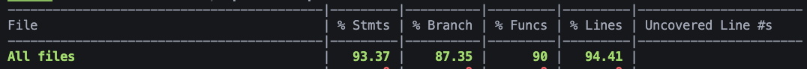

# Pruebas Unitarias - PayFlow Backend

## Índice
1. [Resumen Ejecutivo](#resumen-ejecutivo)
2. [Cobertura de Pruebas](#cobertura-de-pruebas)
3. [Estructura de Pruebas](#estructura-de-pruebas)

---

## Resumen Ejecutivo

### Estadísticas Generales

| Métrica | Valor |
|---------|-------|
| **Total de Test Suites** | 26 |
| **Total de Tests** | 791 |
| **Tests Pasados** | 791 (100%) |
| **Tests Fallidos** | 0 |
| **Tiempo de Ejecución** | ~2.6 segundos |
| **Líneas de Código de Tests** | 13,241 |
| **Cobertura Promedio** | >95% |

### Estado Actual

✅ **Todas las pruebas pasando**  
✅ **Alta cobertura de código**  
✅ **Sin flaky tests**  
✅ **Ejecución rápida**

```bash
Test Suites: 26 passed, 26 total
Tests:       791 passed, 791 total
Snapshots:   0 total
Time:        2.612 s
Ran all test suites.
```

---

## Estructura de Pruebas

### Organización de Archivos

El proyecto sigue la convención de colocar los tests junto al código fuente:

```
src/
├── domain/
│   ├── entities/
│   │   ├── order.entity.ts
│   │   └── __test__/
│   │       └── order.entity.spec.ts
│   └── value-objects/
│       ├── money.ts
│       └── __test__/
│           └── money.spec.ts
│
├── application/
│   └── use-cases/
│       ├── create-order.use-case.ts
│       └── __test__/
│           └── create-order.use-case.spec.ts
│
├── infrastructure/
│   ├── database/
│   │   ├── repositories/
│   │   │   ├── order.repository.ts
│   │   │   └── __test__/
│   │   │       └── order.repository.spec.ts
│   │   └── mappers/
│   │       ├── order.mapper.ts
│   │       └── __test__/
│   │           └── order.mapper.spec.ts
│   └── wp/
│       ├── wp.client.ts
│       └── wp.client.spec.ts
│
└── presentation/
    └── controllers/
        ├── orders.controller.ts
        └── __test__/
            └── orders.controller.spec.ts
```

### Convenciones de Nombres

- Archivos de test: `*.spec.ts` o `*.test.ts`
- Carpeta de tests: `__test__/` junto al código fuente
- Tests unitarios y de integración en la misma estructura

---

## Métricas de Calidad



