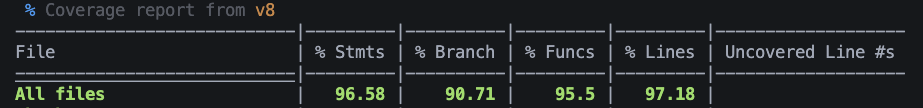

# Pruebas Unitarias del Frontend - PayFlow

## 📋 Índice

1. [Visión General](#visión-general)
2. [Cobertura de Código](#cobertura-de-código)

---

## Visión General

El frontend de PayFlow cuenta con una **suite completa de pruebas unitarias** desarrolladas con **Vitest** y **React Testing Library**. Las pruebas cubren componentes, hooks personalizados, Redux slices, servicios y utilidades, garantizando la calidad y confiabilidad del código.

### Métricas de Testing

```yaml
Total de Archivos de Test: 13
Total de Tests: 319
Tests Pasados: 319 (100%)
Duración: ~2.92 segundos
Framework: Vitest v4.0.18
Testing Library: React Testing Library
Cobertura: 96.58%
```

### Herramientas de Testing

| Herramienta | Versión | Propósito |
|-------------|---------|-----------|
| **Vitest** | Latest | Test runner (compatible con Vite) |
| **React Testing Library** | Latest | Testing de componentes React |
| **@testing-library/react** | Latest | Utilities para testing |
| **@testing-library/user-event** | Latest | Simulación de eventos de usuario |
| **vitest/ui** | Latest | Interfaz visual para tests |

---

## Cobertura de Código

### Métricas de Cobertura

La aplicación frontend mantiene una cobertura de código **superior al 80%** requerido, alcanzando un **96.58%** en todas las áreas críticas:

| Categoría | Cobertura | Meta | Estado |
|-----------|-----------|------|--------|
| **Statements** | **96.58%** | 80%+ | 
| **Branches** | **90.71%** | 80%+ | 
| **Functions** | **95.50%** | 80%+ | 
| **Lines** | **97.18%** | 80%+ |


### Reporte de Cobertura Visual

El siguiente reporte muestra la cobertura detallada de todo el proyecto frontend:



**Análisis del Reporte:**
- ✅ Verde: Código completamente cubierto por tests
- 🟡 Amarillo: Código parcialmente cubierto
- ❌ Rojo: Código sin cobertura de tests

### Generación de Reporte

Para generar un reporte de cobertura actualizado:

```bash
cd apps/client
npm run test:coverage
```

El reporte se genera en `apps/client/coverage/` y puede visualizarse en:
- **HTML**: `coverage/index.html`
- **JSON**: `coverage/coverage-final.json`
- **Text**: Consola

---

### Convención de Nombres

- Archivo de test: `*.test.ts` o `*.test.tsx`
- Carpeta de tests: `__test__/`
- Nombre del describe: Mismo nombre del módulo
- Nombre del test: Descripción clara en español

---